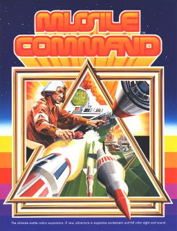

<h2>Table of Contents</h2>

<ul>
<li><a href="#orgheadline1">1. Missile command</a></li>
<li><a href="#orgheadline9">2. Game features <code>[0/8]</code></a>
<ul>
<li><a href="#orgheadline2">2.1. Controls</a></li>
<li><a href="#orgheadline3">2.2. Components</a></li>
<li><a href="#orgheadline4">2.3. Game loop</a></li>
<li><a href="#orgheadline5">2.4. Sprites</a></li>
<li><a href="#orgheadline6">2.5. Scoring</a></li>
<li><a href="#orgheadline7">2.6. New Game</a></li>
<li><a href="#orgheadline8">2.7. End Game</a></li>
</ul>
</li>
<li><a href="#orgheadline10">3. Extras</a></li>
</ul>

# Missile command

A clone of the classic arcade game [Missile Command](https://en.wikipedia.org/wiki/Missile_Command) where you need to protect yourself against the enemies nuclear missiles.

# Game features <code>[0/8]</code>

A list of the features in the game making the development easier

-   [ ] Controls
-   [ ] Game loop
-   [-] Sprites
    -   [X] Drawing circles
    -   [ ] missiles
    -   [ ] bases
    -   [ ] enemies
-   [ ] Scoring
-   [ ] New game
-   [ ] End game
-   [ ] Object pools
    -   [ ] Your missiles
    -   [ ] Enemy weapons
-   [ ] Components
    -   [ ] Render
    -   [ ] Collision
    -   [ ] Input
        -   [ ] Player
        -   [ ] Enemy

## Controls

The player controls a cursor to aim the missiles, three buttons are used for sending missiles from each of the silos.

## Components

Player, enemies, collission, render,

## Game loop

Object pool for missiles, missiles have a target location, starting location and a velocity. When the missile reaches it's target location it explodes.

## Sprites

Missiles, cities, aircraft, drones, cursor
create [color cursor sdl](https://wiki.libsdl.org/SDL_CreateColorCursor)

## Scoring

At the conclusion of a level, the player receives bonus points for any remaining cities (50 points times scoring level, 1 to 6, first 254 levels; 256, levels 255 & 256) or unused missiles (5 points times scoring level, 1 to 6, first 254 levels; 256, levels 255 & 256). Between levels missile batteries are rebuilt and replenished; destroyed cities are rebuilt only at set point levels (usually per 8,000 to 12,000 points). 

## New Game

Start a new round after the round is finished

## End Game

End the game when the player loses

# Extras

Extra game features that is nice but not needed for the demo

-   [ ] Leaderboard
-   [ ] Nicer sprites
    -   [ ] cursor
    -   [ ] missile
    -   [ ] town
-   [ ] Sound